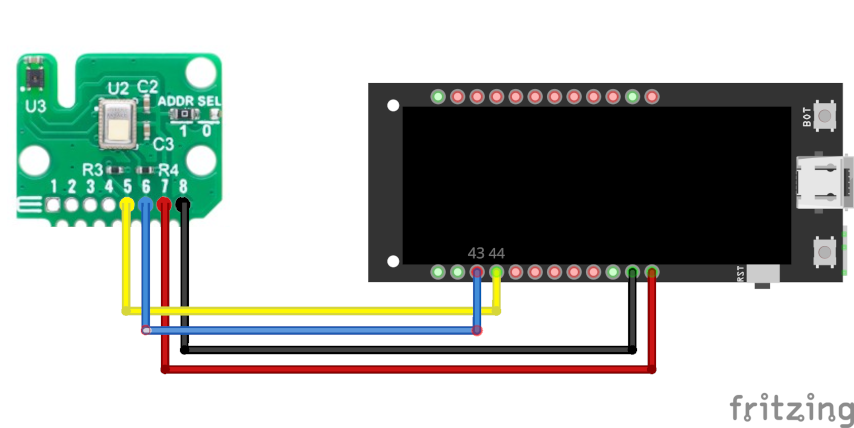

# Arduino STCC4 Demonstrator
A simple LVGL-based project to demonstrate the new STCC4.

## Hardware
The hardware used is:
- LilyGo T-Display-S3
- MikroE Environment 7 Click

### Wiring
We use pin 33 (SDA) and 34 (SCL) of the board for I2C communication:

We use the 3V pin to power the sensor.

## Software
Software is mostly generated code by EEZ Studio and a main arduino script (`stcc4-mikroE-demo.ino`)

## Dependencies
The following libraries are required
- `Arduino I2C STCC4` by [Sensirion](https://github.com/Sensirion/arduino-i2c-stcc4)
- `lvgl` by [kisvegabor](https://github.com/lvgl/lvgl)
- `TFT_eSPI` by [Bodmer](https://github.com/Bodmer/TFT_eSPI)

## Manual steps
After installing the dependencies, you should select the right board in the `TFT_eSPI` library files.
You can do so by:
- Open your `Arduino/libraries` folder
- Open `TFT_eSPI`
- Comment out the line `#include <User_Setup.h> `, uncomment `#include <User_Setups/Setup206_LilyGo_T_Display_S3.h>` from the file `User_setup_select.h`
- Save the file

## How to flash this demo ?
The folder can be opened in `Arduino IDE`. Once the right board and port is selected, the sketch should compile, and can be flashed